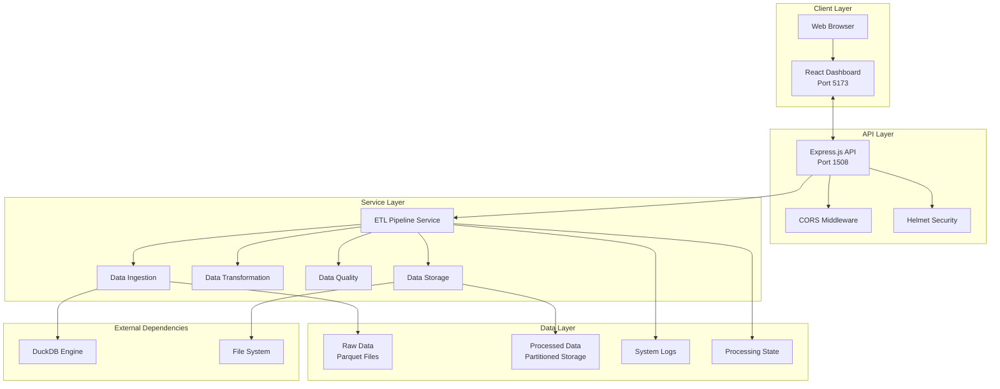
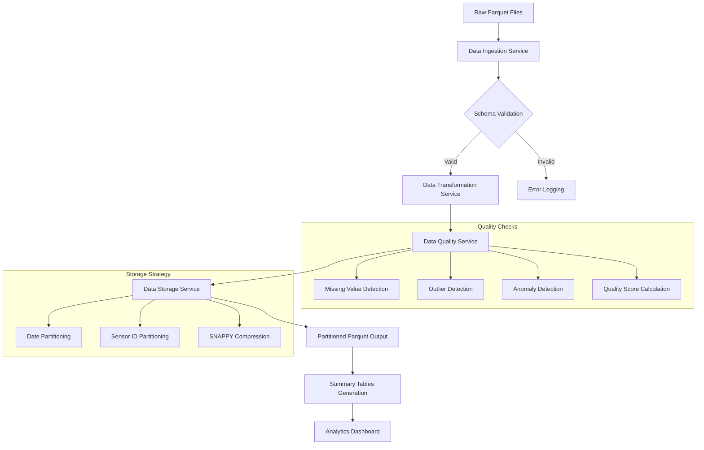

# Agricultural Pipeline - Architecture Overview

## 🏗️ System Architecture

The AgR Pipeline is a comprehensive full-stack solution designed for agricultural sensor data processing. It follows a modern microservices-inspired architecture with clear separation of concerns and scalable design patterns.

## High-Level Architecture



## Component Architecture

### Frontend Architecture (React + Vite)

The frontend is built with modern React 19 and follows a component-based architecture:

```
frontend/
├── src/
│   ├── components/          # React Components
│   │   ├── AnalyticsDashboard.jsx    # Data visualization
│   │   ├── DataViewer.jsx            # Data exploration
│   │   ├── LogViewer.jsx             # System monitoring
│   │   ├── ProcessingFlow.jsx        # Pipeline status
│   │   ├── QualityReport.jsx         # Data quality metrics
│   │   └── Settings.jsx              # System configuration
│   ├── services/            # API Integration
│   │   └── apiService.js             # Centralized API calls
│   ├── assets/              # Static resources
│   ├── App.jsx              # Main application component
│   └── main.jsx             # Application entry point
├── public/                  # Static assets
└── dist/                    # Production build output
```

#### Frontend Technology Stack

- **React 19**: Latest React features with concurrent rendering
- **Vite**: Fast build tool and development server
- **Ant Design**: Professional UI component library
- **Tailwind CSS**: Utility-first CSS framework
- **Chart.js & Recharts**: Data visualization libraries
- **Axios**: HTTP client for API communication
- **date-fns**: Modern date utility library

#### Key Frontend Components

1. **App.jsx**: Main application container with routing and global state
2. **AnalyticsDashboard.jsx**: Interactive charts and data visualization
3. **DataViewer.jsx**: Table-based data exploration with filtering
4. **QualityReport.jsx**: Data quality metrics and visual indicators
5. **ProcessingFlow.jsx**: Real-time pipeline monitoring
6. **Settings.jsx**: System configuration and management

### Backend Architecture (Node.js + Express)

The backend follows a layered architecture pattern with clear separation of concerns:

```
backend/
├── src/
│   ├── config/              # Configuration Management
│   │   ├── app.js                    # Application settings
│   │   ├── database.js               # Database configuration
│   │   └── index.js                  # Configuration exports
│   ├── controllers/         # Request Handlers
│   │   ├── dataController.js         # Data CRUD operations
│   │   ├── pipelineController.js     # Pipeline management
│   │   ├── statusController.js       # System status
│   │   └── uploadController.js       # File upload handling
│   ├── models/              # Data Models
│   │   └── SensorData.js             # Sensor data schema
│   ├── routes/              # API Routes
│   │   └── index.js                  # Route definitions
│   ├── services/            # Business Logic
│   │   ├── etlPipeline.js            # Main pipeline orchestrator
│   │   ├── dataIngestion.js          # Data reading and validation
│   │   ├── dataTransformation.js     # Data cleaning and processing
│   │   ├── dataQuality.js            # Quality analysis
│   │   └── dataStorage.js            # Data persistence
│   ├── utils/               # Utility Functions
│   │   ├── fileSystem.js             # File operations
│   │   ├── logging.js                # Logging utilities
│   │   └── statistics.js             # Statistical calculations
│   └── server.js            # Application entry point
└── data/                    # Data Storage
    ├── raw/                          # Input Parquet files
    ├── processed/                    # Partitioned output
    ├── checkpoints/                  # Processing state
    └── logs/                         # System logs
```

#### Backend Technology Stack

- **Node.js 18+**: JavaScript runtime environment
- **Express.js**: Web application framework
- **DuckDB**: High-performance analytical database
- **Parquet.js**: Parquet file format handling
- **Multer**: File upload middleware
- **Helmet**: Security middleware
- **Moment.js**: Date manipulation and timezone handling
- **Jest**: Testing framework

## Data Flow Architecture

### ETL Pipeline Flow



## Service Layer Architecture

### ETL Pipeline Service (Orchestrator)

```javascript
class ETLPipelineService {
    // Core pipeline orchestration
    async runPipeline()
    async processFile(filePath)
    async getStats()

    // Data retrieval and filtering
    async getProcessedData(filters)

    // Quality and reporting
    async generateDataQualityReport()

    // State management
    async clearCheckpoints()
    async resetPipeline()
}
```

### Data Ingestion Service

```javascript
class DataIngestionService {
    // File processing
    async readParquetFile(filePath)
    async validateSchemaWithDuckDB(filePath)

    // Data validation
    async validateDataWithDuckDB(data)
    async processParquetData(data)
}
```

### Data Transformation Service

```javascript
class DataTransformationService {
    // Core transformation
    async transformData(data)
    async transformRecord(record)

    // Data cleaning
    async fillMissingValues(data)
    async detectOutliers(data)
    async calibrateValues(data)

    // Timestamp handling
    async normalizeTimestamp(timestamp)
    async standardizeTimestamps(data)
}
```

### Data Quality Service

```javascript
class DataQualityService {
    // Quality analysis
    async generateDataQualityReport(data)
    async calculateMissingValues(data)
    async detectOutliers(data)

    // Scoring and validation
    async calculateQualityScore(data)
    async validateDataIntegrity(data)
}
```

### Data Storage Service

```javascript
class DataStorageService {
    // Storage operations
    async writeParquetPartitioned(data)
    async ensurePartitionDirectories(data)

    // Compression and optimization
    async compressData(data)
    async writeToFile(filePath, data)
}
```

## API Architecture

### RESTful API Design

The API follows REST principles with clear resource-based endpoints:

```
GET    /health                 # System health check
GET    /api/status             # Pipeline status and statistics
POST   /api/upload             # File upload and processing
POST   /api/process-files      # Process existing files
GET    /api/data               # Retrieve processed data
GET    /api/quality-report     # Data quality analysis
GET    /api/checkpoints        # Checkpoint management
DELETE /api/checkpoints        # Clear checkpoints
DELETE /api/reset              # Reset entire pipeline
```

## Data Storage Architecture

### Partitioning Strategy

Data is organized using a hierarchical partitioning strategy:

```
data/processed/
├── date=2025-07-18/
│   ├── sensor_id=sensor_001/
│   │   └── data.json
│   ├── sensor_id=sensor_002/
│   │   └── data.json
│   └── ...
├── date=2025-07-19/
│   └── ...
└── summaries/
    ├── daily_summary.parquet
    ├── sensor_summary.parquet
    └── anomaly_summary.parquet
```

### Authentication (Future Enhancement)

The architecture is designed to support future authentication:

- JWT token-based authentication
- Role-based access control (RBAC)
- API key management
- Rate limiting


### Logging Architecture

```
logs/
├── sensor_data.log          # Data processing logs
├── system.log               # Application logs
├── error.log                # Error tracking
└── access.log               # API access logs
```

## Technology Decisions and Rationale

### Why Node.js?

- **JavaScript Ecosystem**: Unified language across stack
- **NPM Packages**: Rich ecosystem for data processing
- **Async I/O**: Excellent for I/O-intensive operations
- **JSON Native**: Natural JSON data handling

### Why React?

- **Component Reusability**: Modular UI development
- **Rich Ecosystem**: Extensive component libraries
- **Performance**: Virtual DOM and efficient updates
- **Developer Experience**: Excellent tooling and debugging

### Why DuckDB?

- **Performance**: Optimized for analytical workloads
- **Parquet Support**: Native Parquet file handling
- **Embedded**: No separate database server required
- **SQL Interface**: Familiar query language

### Why Parquet?

- **Columnar Storage**: Efficient for analytical queries
- **Compression**: Excellent compression ratios
- **Schema Evolution**: Support for schema changes
- **Ecosystem**: Wide tool and library support

## Future Architecture Enhancements

### Planned Improvements

1. **Microservices**: Split services into independent containers
2. **Message Queues**: Async processing with Redis/RabbitMQ
3. **Database Integration**: PostgreSQL/MongoDB support
4. **Real-time Processing**: WebSocket-based real-time updates
5. **Machine Learning**: Integration with ML pipelines
6. **Multi-tenancy**: Support for multiple organizations

### Scalability Roadmap

1. **Phase 1**: Current single-node architecture
2. **Phase 2**: Database separation and clustering
3. **Phase 3**: Microservice decomposition
4. **Phase 4**: Container orchestration (Kubernetes)
5. **Phase 5**: Cloud-native deployment

---

**Next**: [Setup Instructions](SETUP.md) | [Calibration & Anomaly Detection](CALIBRATION_AND_ANOMALY.md)
