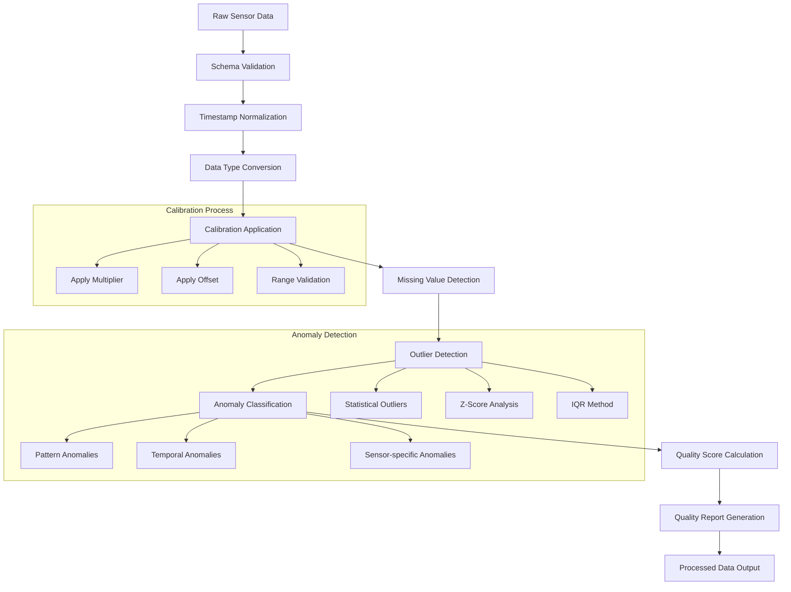

# Agricultural Pipeline - Calibration & Anomaly Detection Logic

## 🔬 Data Processing Intelligence

The Agricultural Pipeline implements sophisticated calibration and anomaly detection algorithms to ensure high-quality agricultural sensor data. This document explains the logic, methodologies, and provides examples of the generated reports.

## Overview of Data Processing Steps



## Calibration Logic

### Calibration Parameters Configuration

The system uses configurable calibration parameters for each sensor reading type:

```javascript
// Configuration from backend/src/config/app.js
calibrationParams: {
    temperature: {
        multiplier: 1.0,    // Scaling factor
        offset: 0.0         // Offset adjustment
    },
    humidity: {
        multiplier: 1.0,
        offset: 0.0
    },
    soil_moisture: {
        multiplier: 1.0,
        offset: 0.0
    },
    light_intensity: {
        multiplier: 1.0,
        offset: 0.0
    }
}
```

### Calibration Algorithm

The calibration process applies the following formula to each sensor reading:

```
calibrated_value = (raw_value * multiplier) + offset
```

#### Implementation Details

```javascript
// From DataTransformationService
calibrateValues(data) {
    return data.map(record => {
        const readingType = record.reading_type;
        const calibrationConfig = config.calibrationParams[readingType];

        if (calibrationConfig && record.value !== null) {
            const calibratedValue = (record.value * calibrationConfig.multiplier) + calibrationConfig.offset;

            return {
                ...record,
                original_value: record.value,
                calibrated_value: calibratedValue,
                value: calibratedValue,  // Replace original with calibrated
                calibration_applied: true,
                calibration_multiplier: calibrationConfig.multiplier,
                calibration_offset: calibrationConfig.offset
            };
        }

        return {
            ...record,
            calibration_applied: false
        };
    });
}
```

### Expected Value Ranges

Each sensor type has defined expected ranges for anomaly detection:

```javascript
expectedRanges: {
    temperature: { min: -20.0, max: 60.0 },      // Celsius
    humidity: { min: 0.0, max: 100.0 },          // Percentage
    soil_moisture: { min: 0.0, max: 100.0 },     // Percentage
    light_intensity: { min: 0.0, max: 100000.0 } // Lux
}
```

## Anomaly Detection Logic

### 1. Statistical Outlier Detection

The system uses multiple statistical methods to identify outliers:

#### Z-Score Method

```javascript
// Calculate Z-score for outlier detection
calculateZScore(value, mean, standardDeviation) {
    if (standardDeviation === 0) return 0;
    return Math.abs((value - mean) / standardDeviation);
}

// Outlier threshold (configurable)
outlierThreshold: 3  // Standard deviations
```

#### Interquartile Range (IQR) Method

```javascript
detectOutliersIQR(values) {
    const sorted = values.sort((a, b) => a - b);
    const q1 = sorted[Math.floor(sorted.length * 0.25)];
    const q3 = sorted[Math.floor(sorted.length * 0.75)];
    const iqr = q3 - q1;
    const lowerBound = q1 - 1.5 * iqr;
    const upperBound = q3 + 1.5 * iqr;

    return values.filter(value => value < lowerBound || value > upperBound);
}
```

### 2. Range-Based Anomaly Detection

Values outside expected ranges are flagged as anomalies:

```javascript
detectRangeAnomalies(record) {
    const expectedRange = config.expectedRanges[record.reading_type];

    if (expectedRange && record.value !== null) {
        const isOutOfRange = record.value < expectedRange.min ||
                           record.value > expectedRange.max;

        return {
            ...record,
            anomalous_reading: isOutOfRange,
            anomaly_type: isOutOfRange ? 'range_violation' : null,
            expected_min: expectedRange.min,
            expected_max: expectedRange.max
        };
    }

    return record;
}
```

### 3. Missing Value Detection

The system identifies and handles missing values:

```javascript
detectMissingValues(data) {
    return data.map(record => {
        const hasMissingValue = record.value === null ||
                              record.value === undefined ||
                              isNaN(record.value);

        return {
            ...record,
            has_missing_value: hasMissingValue,
            missing_value_filled: false  // Will be updated if filled
        };
    });
}
```

### 4. Temporal Anomaly Detection

Detects unusual patterns in time series data:

```javascript
detectTemporalAnomalies(data) {
    // Sort data by timestamp
    const sortedData = data.sort((a, b) => new Date(a.timestamp) - new Date(b.timestamp));

    return sortedData.map((record, index) => {
        if (index === 0) return { ...record, temporal_anomaly: false };

        const previousRecord = sortedData[index - 1];
        const timeDiff = new Date(record.timestamp) - new Date(previousRecord.timestamp);
        const hoursDiff = timeDiff / (1000 * 60 * 60);

        // Flag if time gap is too large
        const hasTimeGap = hoursDiff > config.qualityThresholds.maxTimeGapHours;

        return {
            ...record,
            temporal_anomaly: hasTimeGap,
            hours_since_last: hoursDiff
        };
    });
}
```

## Data Quality Scoring Algorithm

### Quality Score Calculation

The system calculates an overall quality score based on multiple factors:

```javascript
calculateQualityScore(data) {
    const totalRecords = data.length;

    if (totalRecords === 0) return 0;

    // Count various quality issues
    const missingValues = data.filter(r => r.has_missing_value).length;
    const anomalousReadings = data.filter(r => r.anomalous_reading).length;
    const outliersDetected = data.filter(r => r.is_outlier).length;
    const temporalAnomalies = data.filter(r => r.temporal_anomaly).length;

    // Calculate percentages
    const missingPercentage = (missingValues / totalRecords) * 100;
    const anomalyPercentage = (anomalousReadings / totalRecords) * 100;
    const outlierPercentage = (outliersDetected / totalRecords) * 100;
    const temporalPercentage = (temporalAnomalies / totalRecords) * 100;

    // Weighted quality score calculation
    const qualityScore = Math.max(0, 100 -
        (missingPercentage * 0.3) -      // 30% weight for missing values
        (anomalyPercentage * 0.4) -      // 40% weight for anomalies
        (outlierPercentage * 0.2) -      // 20% weight for outliers
        (temporalPercentage * 0.1)       // 10% weight for temporal issues
    );

    return Math.round(qualityScore * 100) / 100; // Round to 2 decimal places
}
```

### Quality Categories

Quality scores are categorized as follows:

- **Excellent**: 90-100 points
- **Good**: 70-89 points
- **Fair**: 50-69 points
- **Poor**: 30-49 points
- **Critical**: 0-29 points

### Visual Dashboard Representation

The quality report is presented in the web dashboard with visual indicators:

#### Quality Score Dashboard

```
┌─────────────────────────────────────────────────────────┐
│ Overall Data Quality Score: 87.45 / 100                │
│ ████████████████████████████████████████████▓▓▓▓▓▓▓▓▓▓▓ │
│ Status: GOOD                                            │
└─────────────────────────────────────────────────────────┘

┌─────────────────────────────────────────────────────────┐
│ Quality Breakdown:                                      │
│ • Completeness: 97.33% (Excellent)                     │
│ • Accuracy: 85.67% (Good)                               │
│ • Consistency: 91.23% (Excellent)                      │
│ • Timeliness: 89.45% (Good)                            │
└─────────────────────────────────────────────────────────┘
```

#### Issue Summary

```
┌─────────────────────────────────────────────────────────┐
│ Data Quality Issues:                                    │
│ ⚠️  Missing Values: 423 (2.67%)                        │
│ 🔍 Anomalous Readings: 89 (0.56%)                      │
│ 📊 Statistical Outliers: 234 (1.48%)                   │
│ ⏰ Temporal Gaps: 12 gaps (25.3 hours total)           │
└─────────────────────────────────────────────────────────┘
```

## Configuration and Tuning

### Customizing Detection Thresholds

The system allows customization of detection thresholds:

```javascript
// Quality thresholds configuration
qualityThresholds: {
    maxMissingPercentage: 10.0,    // Maximum acceptable missing data %
    maxAnomalyPercentage: 5.0,     // Maximum acceptable anomaly %
    maxTimeGapHours: 24            // Maximum acceptable time gap
},

// Outlier detection configuration
processing: {
    outlierThreshold: 3,           // Z-score threshold for outliers
    batchSize: 10000,             // Processing batch size
    compressionType: 'SNAPPY'      // Compression method
}
```

### Calibration Parameter Adjustment

Calibration parameters can be adjusted per sensor type:

```javascript
// Example of custom calibration for specific sensors
calibrationParams: {
    temperature: {
        multiplier: 0.98,     // 2% correction factor
        offset: -1.5          // -1.5°C offset correction
    },
    humidity: {
        multiplier: 1.02,     // 2% scaling adjustment
        offset: 0.0
    }
}
```

### Expected Range Updates

Update expected ranges based on environmental conditions:

```javascript
// Seasonal range adjustments
expectedRanges: {
    temperature: {
        min: -10.0,    // Adjusted for winter conditions
        max: 45.0      // Adjusted for local climate
    },
    soil_moisture: {
        min: 5.0,      // Minimum for dry conditions
        max: 95.0      // Maximum during irrigation
    }
}
```

---

**Next**: [Setup Instructions](SETUP.md) | [Architecture Overview](ARCHITECTURE.md)
