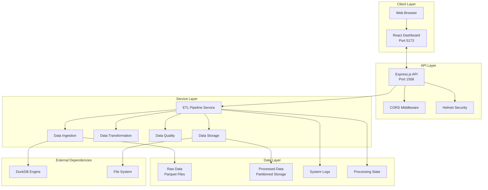
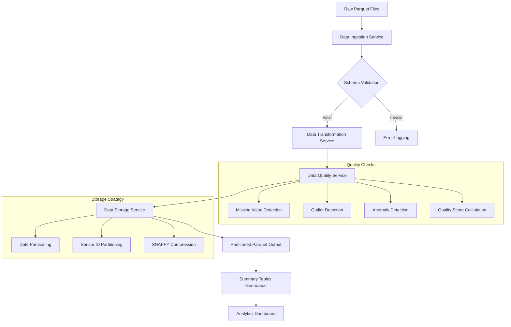
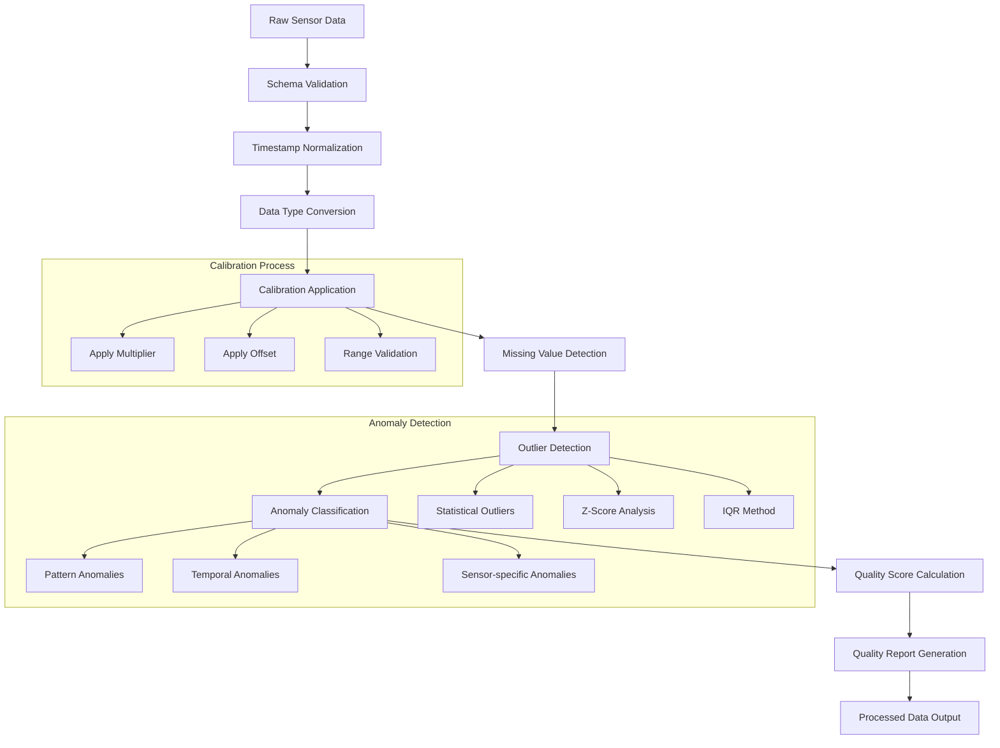

# Agricultural Pipeline - Setup & Run Instructions

## 🚀 Quick Start Guide

This guide will help you set up and run the AgR Pipeline system on your local machine or production environment.

## Prerequisites

Before installing the AgR Pipeline, ensure your system meets these requirements:

### System Requirements

- **Node.js 18+** (recommended: use nvm for version management)
- **npm 8+** or **yarn 1.22+**
- **Git** for version control
- **PowerShell** (Windows) or **Bash** (Linux/macOS)

## Installation Methods

### Method 1: Development Setup (Recommended for Development)

#### 1. Clone Repository

```bash
# Clone the repository
git clone [https://github.com/indrareddy15/agr-pipeline.git](https://github.com/indrareddy15/agr-pipline.git)
cd dir

# Verify project structure
ls -la
# Should show: backend/ frontend/ package.json README.md
```

#### 2. Install Dependencies

```bash
# Install all dependencies (backend + frontend)
npm run install:all

# OR install individually
cd backend && npm install
cd ../frontend && npm install
cd .. && npm install
```

#### 4. Start Development Environment

```bash
# Start both services concurrently (recommended)
cd dir && npm run dev
# This starts both backend (port 1508) and frontend (port 5173)
```

#### 5. Verify Installation

Open your browser and check:

1. **Frontend Dashboard**: http://localhost:5173

   - Should show AgR Pipeline Dashboard with navigation menu

2. **Backend API Health**: http://localhost:1508/health

   - Should return: `{"status":"healthy","timestamp":"...","service":"Agr Pipeline API"}`

3. **API Status**: http://localhost:1508/api/status
   - Should return pipeline status JSON

## Directory Structure Setup

The system automatically creates necessary directories on first run:

```
agr-pipeline/
├── backend/
│   ├── data/                    # Auto-created
│   │   ├── raw/                # Input Parquet files
│   │   ├── processed/          # Partitioned output
│   │   ├── checkpoints/        # Processing state
│   │   ├── logs/              # System logs
│   │   └── temp/              # Temporary files
│   ├── src/                    # Source code
│   └── package.json
├── frontend/
│   ├── src/                    # React source
│   ├── dist/                   # Built files (after build)
│   └── package.json
└── package.json               # Root package
```

## Available Scripts

### Root Level Scripts

```bash
# Installation
npm run install           # Install all dependencies

# Development
npm run dev                    # Start both services [RECOMMENDED]
npm run dev:backend            # Start backend only
npm run dev:frontend           # Start frontend only

# Production
npm run build                  # Build frontend for production
npm run start                  # Start production server (single-port)
npm run start:backend          # Start backend only
npm run start:frontend         # Start frontend only (development server)

# Testing
npm test                       # Run all tests
npm run test:backend          # Run backend tests
npm run lint                  # Lint frontend code

```

## Configuration Options

### Backend Configuration

The backend uses sensible defaults but can be configured via environment variables:

```bash
# Optional environment variables
PORT=1508                     # Server port (default: 1508)
NODE_ENV=development          # Environment mode
CORS_ORIGIN=*                 # CORS origin (default: all)
```

### Data Processing Configuration

Configuration is handled in `backend/src/config/app.js`:

```javascript
// Processing settings
processing: {
    batchSize: 10000,         // Records per batch
    outlierThreshold: 3,      // Standard deviations for outlier detection
    compressionType: 'SNAPPY' // Parquet compression
}

// Data quality thresholds
qualityThresholds: {
    maxMissingPercentage: 10.0,   // Max missing data allowed
    maxAnomalyPercentage: 5.0,    // Max anomalies allowed
    maxTimeGapHours: 24           // Max time gap in data
}
```

## Troubleshooting

### Common Issues

#### Port Already in Use

```bash
# Kill process on port 1508
npx kill-port 1508

# Or use different port
PORT=3001 npm run dev:backend
```

#### Dependencies Issues

```bash
# Clear cache and reinstall
npm run clean
npm run install:all
```

### Debug Mode

Enable debug logging:

```bash
# Backend debug mode
cd backend
DEBUG=agr:* npm run dev

# Frontend verbose mode
cd frontend
npm run dev -- --verbose
```

### Performance Issues

If you experience slow processing:

1. **Increase memory allocation:**

   ```bash
   NODE_OPTIONS="--max-old-space-size=4096" npm run dev:backend
   ```

2. **Reduce batch size** in `backend/src/config/app.js`:

   ```javascript
   processing: {
     batchSize: 5000; // Reduced from 10000
   }
   ```

---

# Agricultural Pipeline - Architecture Overview

## 🏗️ System Architecture

The AgR Pipeline is a comprehensive full-stack solution designed for agricultural sensor data processing. It follows a modern microservices-inspired architecture with clear separation of concerns and scalable design patterns.

## High-Level Architecture



## Component Architecture

### Frontend Architecture (React + Vite)

The frontend is built with modern React 19 and follows a component-based architecture:

```
frontend/
├── src/
│   ├── components/          # React Components
│   │   ├── AnalyticsDashboard.jsx    # Data visualization
│   │   ├── DataViewer.jsx            # Data exploration
│   │   ├── LogViewer.jsx             # System monitoring
│   │   ├── ProcessingFlow.jsx        # Pipeline status
│   │   ├── QualityReport.jsx         # Data quality metrics
│   │   └── Settings.jsx              # System configuration
│   ├── services/            # API Integration
│   │   └── apiService.js             # Centralized API calls
│   ├── assets/              # Static resources
│   ├── App.jsx              # Main application component
│   └── main.jsx             # Application entry point
├── public/                  # Static assets
└── dist/                    # Production build output
```

#### Frontend Technology Stack

- **React 19**: Latest React features with concurrent rendering
- **Vite**: Fast build tool and development server
- **Ant Design**: Professional UI component library
- **Tailwind CSS**: Utility-first CSS framework
- **Chart.js & Recharts**: Data visualization libraries
- **Axios**: HTTP client for API communication
- **date-fns**: Modern date utility library

#### Key Frontend Components

1. **App.jsx**: Main application container with routing and global state
2. **AnalyticsDashboard.jsx**: Interactive charts and data visualization
3. **DataViewer.jsx**: Table-based data exploration with filtering
4. **QualityReport.jsx**: Data quality metrics and visual indicators
5. **ProcessingFlow.jsx**: Real-time pipeline monitoring
6. **Settings.jsx**: System configuration and management

### Backend Architecture (Node.js + Express)

The backend follows a layered architecture pattern with clear separation of concerns:

```
backend/
├── src/
│   ├── config/              # Configuration Management
│   │   ├── app.js                    # Application settings
│   │   ├── database.js               # Database configuration
│   │   └── index.js                  # Configuration exports
│   ├── controllers/         # Request Handlers
│   │   ├── dataController.js         # Data CRUD operations
│   │   ├── pipelineController.js     # Pipeline management
│   │   ├── statusController.js       # System status
│   │   └── uploadController.js       # File upload handling
│   ├── models/              # Data Models
│   │   └── SensorData.js             # Sensor data schema
│   ├── routes/              # API Routes
│   │   └── index.js                  # Route definitions
│   ├── services/            # Business Logic
│   │   ├── etlPipeline.js            # Main pipeline orchestrator
│   │   ├── dataIngestion.js          # Data reading and validation
│   │   ├── dataTransformation.js     # Data cleaning and processing
│   │   ├── dataQuality.js            # Quality analysis
│   │   └── dataStorage.js            # Data persistence
│   ├── utils/               # Utility Functions
│   │   ├── fileSystem.js             # File operations
│   │   ├── logging.js                # Logging utilities
│   │   └── statistics.js             # Statistical calculations
│   └── server.js            # Application entry point
└── data/                    # Data Storage
    ├── raw/                          # Input Parquet files
    ├── processed/                    # Partitioned output
    ├── checkpoints/                  # Processing state
    └── logs/                         # System logs
```

#### Backend Technology Stack

- **Node.js 18+**: JavaScript runtime environment
- **Express.js**: Web application framework
- **DuckDB**: High-performance analytical database
- **Parquet.js**: Parquet file format handling
- **Multer**: File upload middleware
- **Helmet**: Security middleware
- **Moment.js**: Date manipulation and timezone handling
- **Jest**: Testing framework

## Data Flow Architecture

### ETL Pipeline Flow



## Service Layer Architecture

### ETL Pipeline Service (Orchestrator)

```javascript
class ETLPipelineService {
    // Core pipeline orchestration
    async runPipeline()
    async processFile(filePath)
    async getStats()

    // Data retrieval and filtering
    async getProcessedData(filters)

    // Quality and reporting
    async generateDataQualityReport()

    // State management
    async clearCheckpoints()
    async resetPipeline()
}
```

### Data Ingestion Service

```javascript
class DataIngestionService {
    // File processing
    async readParquetFile(filePath)
    async validateSchemaWithDuckDB(filePath)

    // Data validation
    async validateDataWithDuckDB(data)
    async processParquetData(data)
}
```

### Data Transformation Service

```javascript
class DataTransformationService {
    // Core transformation
    async transformData(data)
    async transformRecord(record)

    // Data cleaning
    async fillMissingValues(data)
    async detectOutliers(data)
    async calibrateValues(data)

    // Timestamp handling
    async normalizeTimestamp(timestamp)
    async standardizeTimestamps(data)
}
```

### Data Quality Service

```javascript
class DataQualityService {
    // Quality analysis
    async generateDataQualityReport(data)
    async calculateMissingValues(data)
    async detectOutliers(data)

    // Scoring and validation
    async calculateQualityScore(data)
    async validateDataIntegrity(data)
}
```

### Data Storage Service

```javascript
class DataStorageService {
    // Storage operations
    async writeParquetPartitioned(data)
    async ensurePartitionDirectories(data)

    // Compression and optimization
    async compressData(data)
    async writeToFile(filePath, data)
}
```

## API Architecture

### RESTful API Design

The API follows REST principles with clear resource-based endpoints:

```
GET    /health                 # System health check
GET    /api/status             # Pipeline status and statistics
POST   /api/upload             # File upload and processing
POST   /api/process-files      # Process existing files
GET    /api/data               # Retrieve processed data
GET    /api/quality-report     # Data quality analysis
GET    /api/checkpoints        # Checkpoint management
DELETE /api/checkpoints        # Clear checkpoints
DELETE /api/reset              # Reset entire pipeline
```

## Data Storage Architecture

### Partitioning Strategy

Data is organized using a hierarchical partitioning strategy:

```
data/processed/
├── date=2025-07-18/
│   ├── sensor_id=sensor_001/
│   │   └── data.json
│   ├── sensor_id=sensor_002/
│   │   └── data.json
│   └── ...
├── date=2025-07-19/
│   └── ...
└── summaries/
    ├── daily_summary.parquet
    ├── sensor_summary.parquet
    └── anomaly_summary.parquet
```

### Authentication (Future Enhancement)

The architecture is designed to support future authentication:

- JWT token-based authentication
- Role-based access control (RBAC)
- API key management
- Rate limiting

### Logging Architecture

```
logs/
├── sensor_data.log          # Data processing logs
├── system.log               # Application logs
├── error.log                # Error tracking
└── access.log               # API access logs
```

## Technology Decisions and Rationale

### Why Node.js?

- **JavaScript Ecosystem**: Unified language across stack
- **NPM Packages**: Rich ecosystem for data processing
- **Async I/O**: Excellent for I/O-intensive operations
- **JSON Native**: Natural JSON data handling

### Why React?

- **Component Reusability**: Modular UI development
- **Rich Ecosystem**: Extensive component libraries
- **Performance**: Virtual DOM and efficient updates
- **Developer Experience**: Excellent tooling and debugging

### Why DuckDB?

- **Performance**: Optimized for analytical workloads
- **Parquet Support**: Native Parquet file handling
- **Embedded**: No separate database server required
- **SQL Interface**: Familiar query language

### Why Parquet?

- **Columnar Storage**: Efficient for analytical queries
- **Compression**: Excellent compression ratios
- **Schema Evolution**: Support for schema changes
- **Ecosystem**: Wide tool and library support

## Future Architecture Enhancements

### Planned Improvements

1. **Microservices**: Split services into independent containers
2. **Message Queues**: Async processing with Redis/RabbitMQ
3. **Database Integration**: PostgreSQL/MongoDB support
4. **Real-time Processing**: WebSocket-based real-time updates
5. **Machine Learning**: Integration with ML pipelines
6. **Multi-tenancy**: Support for multiple organizations

### Scalability Roadmap

1. **Phase 1**: Current single-node architecture
2. **Phase 2**: Database separation and clustering
3. **Phase 3**: Microservice decomposition
4. **Phase 4**: Container orchestration (Kubernetes)
5. **Phase 5**: Cloud-native deployment

---

# Agricultural Pipeline - Calibration & Anomaly Detection Logic

## 🔬 Data Processing Intelligence

The Agricultural Pipeline implements sophisticated calibration and anomaly detection algorithms to ensure high-quality agricultural sensor data. This document explains the logic, methodologies, and provides examples of the generated reports.

## Overview of Data Processing Steps



## Calibration Logic

### Calibration Parameters Configuration

The system uses configurable calibration parameters for each sensor reading type:

```javascript
// Configuration from backend/src/config/app.js
calibrationParams: {
    temperature: {
        multiplier: 1.0,    // Scaling factor
        offset: 0.0         // Offset adjustment
    },
    humidity: {
        multiplier: 1.0,
        offset: 0.0
    },
    soil_moisture: {
        multiplier: 1.0,
        offset: 0.0
    },
    light_intensity: {
        multiplier: 1.0,
        offset: 0.0
    }
}
```

### Calibration Algorithm

The calibration process applies the following formula to each sensor reading:

```
calibrated_value = (raw_value * multiplier) + offset
```

#### Implementation Details

```javascript
// From DataTransformationService
calibrateValues(data) {
    return data.map(record => {
        const readingType = record.reading_type;
        const calibrationConfig = config.calibrationParams[readingType];

        if (calibrationConfig && record.value !== null) {
            const calibratedValue = (record.value * calibrationConfig.multiplier) + calibrationConfig.offset;

            return {
                ...record,
                original_value: record.value,
                calibrated_value: calibratedValue,
                value: calibratedValue,  // Replace original with calibrated
                calibration_applied: true,
                calibration_multiplier: calibrationConfig.multiplier,
                calibration_offset: calibrationConfig.offset
            };
        }

        return {
            ...record,
            calibration_applied: false
        };
    });
}
```

### Expected Value Ranges

Each sensor type has defined expected ranges for anomaly detection:

```javascript
expectedRanges: {
    temperature: { min: -20.0, max: 60.0 },      // Celsius
    humidity: { min: 0.0, max: 100.0 },          // Percentage
    soil_moisture: { min: 0.0, max: 100.0 },     // Percentage
    light_intensity: { min: 0.0, max: 100000.0 } // Lux
}
```

## Anomaly Detection Logic

### 1. Statistical Outlier Detection

The system uses multiple statistical methods to identify outliers:

#### Z-Score Method

```javascript
// Calculate Z-score for outlier detection
calculateZScore(value, mean, standardDeviation) {
    if (standardDeviation === 0) return 0;
    return Math.abs((value - mean) / standardDeviation);
}

// Outlier threshold (configurable)
outlierThreshold: 3  // Standard deviations
```

#### Interquartile Range (IQR) Method

```javascript
detectOutliersIQR(values) {
    const sorted = values.sort((a, b) => a - b);
    const q1 = sorted[Math.floor(sorted.length * 0.25)];
    const q3 = sorted[Math.floor(sorted.length * 0.75)];
    const iqr = q3 - q1;
    const lowerBound = q1 - 1.5 * iqr;
    const upperBound = q3 + 1.5 * iqr;

    return values.filter(value => value < lowerBound || value > upperBound);
}
```

### 2. Range-Based Anomaly Detection

Values outside expected ranges are flagged as anomalies:

```javascript
detectRangeAnomalies(record) {
    const expectedRange = config.expectedRanges[record.reading_type];

    if (expectedRange && record.value !== null) {
        const isOutOfRange = record.value < expectedRange.min ||
                           record.value > expectedRange.max;

        return {
            ...record,
            anomalous_reading: isOutOfRange,
            anomaly_type: isOutOfRange ? 'range_violation' : null,
            expected_min: expectedRange.min,
            expected_max: expectedRange.max
        };
    }

    return record;
}
```

### 3. Missing Value Detection

The system identifies and handles missing values:

```javascript
detectMissingValues(data) {
    return data.map(record => {
        const hasMissingValue = record.value === null ||
                              record.value === undefined ||
                              isNaN(record.value);

        return {
            ...record,
            has_missing_value: hasMissingValue,
            missing_value_filled: false  // Will be updated if filled
        };
    });
}
```

### 4. Temporal Anomaly Detection

Detects unusual patterns in time series data:

```javascript
detectTemporalAnomalies(data) {
    // Sort data by timestamp
    const sortedData = data.sort((a, b) => new Date(a.timestamp) - new Date(b.timestamp));

    return sortedData.map((record, index) => {
        if (index === 0) return { ...record, temporal_anomaly: false };

        const previousRecord = sortedData[index - 1];
        const timeDiff = new Date(record.timestamp) - new Date(previousRecord.timestamp);
        const hoursDiff = timeDiff / (1000 * 60 * 60);

        // Flag if time gap is too large
        const hasTimeGap = hoursDiff > config.qualityThresholds.maxTimeGapHours;

        return {
            ...record,
            temporal_anomaly: hasTimeGap,
            hours_since_last: hoursDiff
        };
    });
}
```

## Data Quality Scoring Algorithm

### Quality Score Calculation

The system calculates an overall quality score based on multiple factors:

```javascript
calculateQualityScore(data) {
    const totalRecords = data.length;

    if (totalRecords === 0) return 0;

    // Count various quality issues
    const missingValues = data.filter(r => r.has_missing_value).length;
    const anomalousReadings = data.filter(r => r.anomalous_reading).length;
    const outliersDetected = data.filter(r => r.is_outlier).length;
    const temporalAnomalies = data.filter(r => r.temporal_anomaly).length;

    // Calculate percentages
    const missingPercentage = (missingValues / totalRecords) * 100;
    const anomalyPercentage = (anomalousReadings / totalRecords) * 100;
    const outlierPercentage = (outliersDetected / totalRecords) * 100;
    const temporalPercentage = (temporalAnomalies / totalRecords) * 100;

    // Weighted quality score calculation
    const qualityScore = Math.max(0, 100 -
        (missingPercentage * 0.3) -      // 30% weight for missing values
        (anomalyPercentage * 0.4) -      // 40% weight for anomalies
        (outlierPercentage * 0.2) -      // 20% weight for outliers
        (temporalPercentage * 0.1)       // 10% weight for temporal issues
    );

    return Math.round(qualityScore * 100) / 100; // Round to 2 decimal places
}
```

### Quality Categories

Quality scores are categorized as follows:

- **Excellent**: 90-100 points
- **Good**: 70-89 points
- **Fair**: 50-69 points
- **Poor**: 30-49 points
- **Critical**: 0-29 points

### Visual Dashboard Representation

The quality report is presented in the web dashboard with visual indicators:

#### Quality Score Dashboard

```
┌─────────────────────────────────────────────────────────┐
│ Overall Data Quality Score: 87.45 / 100                │
│ ████████████████████████████████████████████▓▓▓▓▓▓▓▓▓▓▓ │
│ Status: GOOD                                            │
└─────────────────────────────────────────────────────────┘

┌─────────────────────────────────────────────────────────┐
│ Quality Breakdown:                                      │
│ • Completeness: 97.33% (Excellent)                     │
│ • Accuracy: 85.67% (Good)                               │
│ • Consistency: 91.23% (Excellent)                      │
│ • Timeliness: 89.45% (Good)                            │
└─────────────────────────────────────────────────────────┘
```

#### Issue Summary

```
┌─────────────────────────────────────────────────────────┐
│ Data Quality Issues:                                    │
│ ⚠️  Missing Values: 423 (2.67%)                        │
│ 🔍 Anomalous Readings: 89 (0.56%)                      │
│ 📊 Statistical Outliers: 234 (1.48%)                   │
│ ⏰ Temporal Gaps: 12 gaps (25.3 hours total)           │
└─────────────────────────────────────────────────────────┘
```

## Configuration and Tuning

### Customizing Detection Thresholds

The system allows customization of detection thresholds:

```javascript
// Quality thresholds configuration
qualityThresholds: {
    maxMissingPercentage: 10.0,    // Maximum acceptable missing data %
    maxAnomalyPercentage: 5.0,     // Maximum acceptable anomaly %
    maxTimeGapHours: 24            // Maximum acceptable time gap
},

// Outlier detection configuration
processing: {
    outlierThreshold: 3,           // Z-score threshold for outliers
    batchSize: 10000,             // Processing batch size
    compressionType: 'SNAPPY'      // Compression method
}
```

### Calibration Parameter Adjustment

Calibration parameters can be adjusted per sensor type:

```javascript
// Example of custom calibration for specific sensors
calibrationParams: {
    temperature: {
        multiplier: 0.98,     // 2% correction factor
        offset: -1.5          // -1.5°C offset correction
    },
    humidity: {
        multiplier: 1.02,     // 2% scaling adjustment
        offset: 0.0
    }
}
```

### Expected Range Updates

Update expected ranges based on environmental conditions:

```javascript
// Seasonal range adjustments
expectedRanges: {
    temperature: {
        min: -10.0,    // Adjusted for winter conditions
        max: 45.0      // Adjusted for local climate
    },
    soil_moisture: {
        min: 5.0,      // Minimum for dry conditions
        max: 95.0      // Maximum during irrigation
    }
}
```

---
